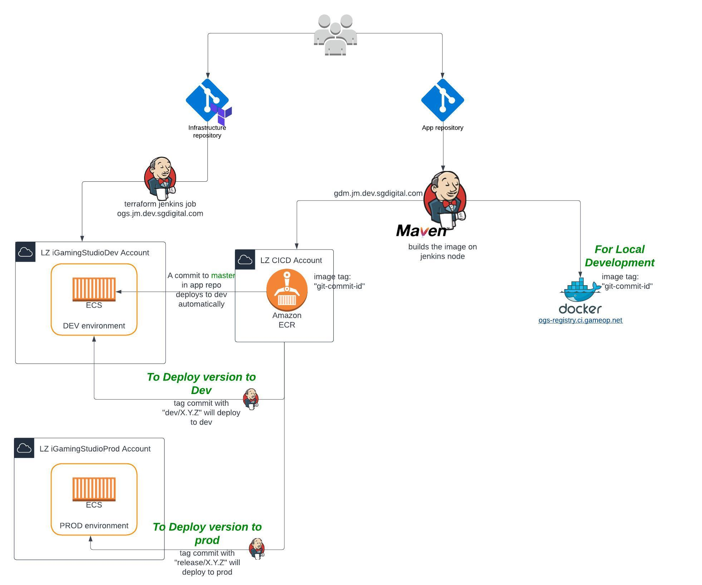
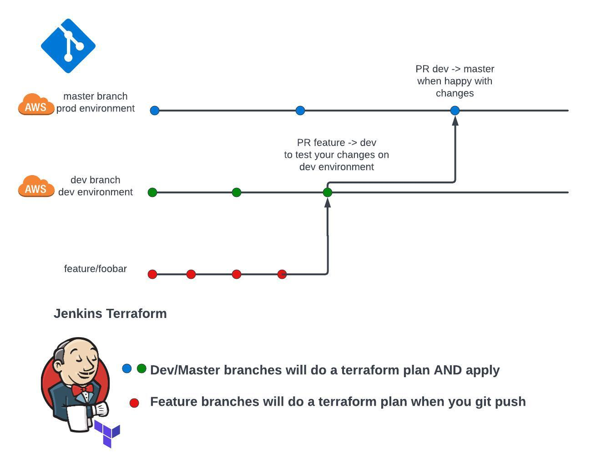
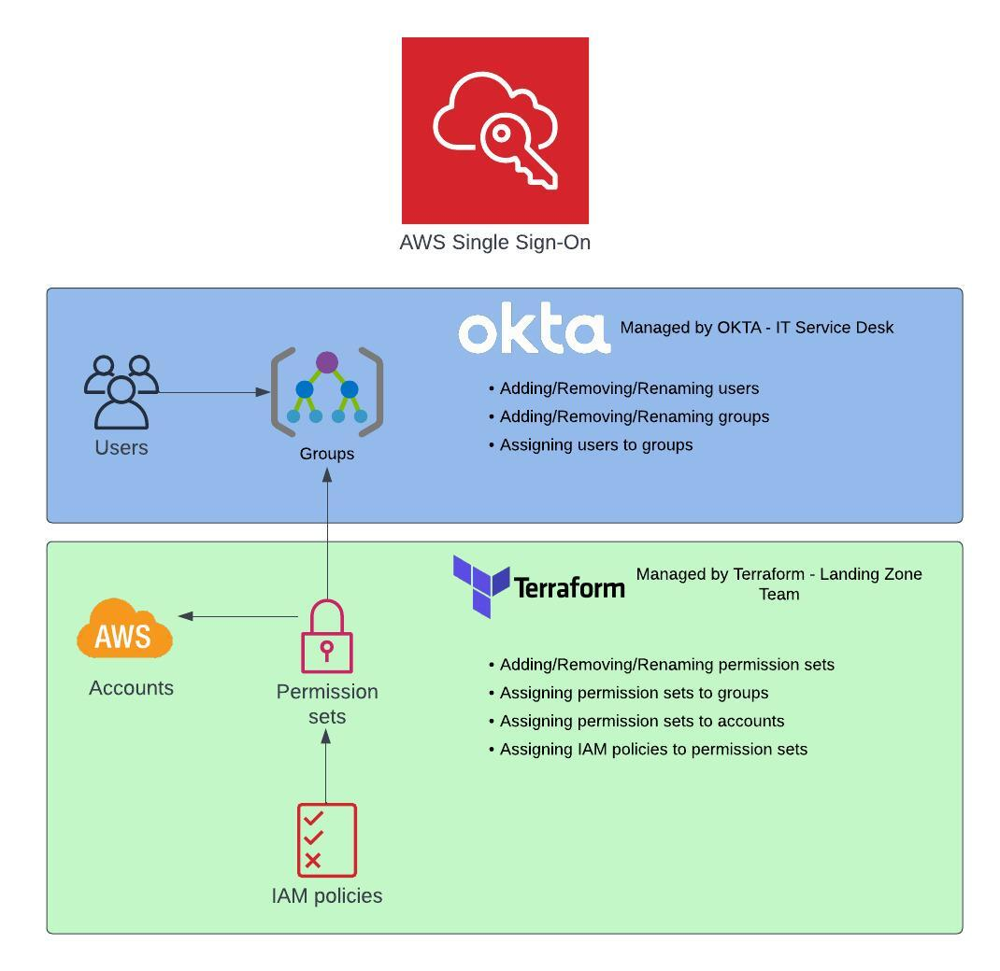

# KSH Portfolio
Some examples of my work.

**⚡️ DevOps - Cloud - SRE - Architecture**

## Features

- Architecturial Diagrams Of Relevant Infrastructure
- Examples Of Code
- Documentation
- Personal Projects

## Replay Service - example of ECS pipeline and terraform
**HCL - S3 - ECS - GROOVY - KAFKA - LAMBDA - GOLANG - POSTGRES - CLOUDWATCH - JAVA/MAVEN**




example project including:
- Replay ECS service Terraform
- Kafka Terraform
- cloudwatch alarms Terraform
- Lambda go packages
- Jenkinsfiles groovy scripts for CI/CD
- Terraform variables
- Terraform modules
- Replay DB postgres user creation Terraform
- shell/bash script for go script package creation
- Documentation

> 🔗[Repository Link](https://github.com/karshee/lz_service_infra "Repository link")

## AWS Landing-Zone

### LZ Permissions
**HCL    -    AWS SSO    -    LZ    -    IAM**

Permissions within landing-zone were managed with Terraform, allowing permissions to be added to a group. Who is allowed in which group is managed by OKTA and corporate IT.

```
#iGaming Studio DBA access
data "aws_identitystore_group" "gaming-studio-dba" {
  identity_store_id = tolist(data.aws_ssoadmin_instances.instance_list.identity_store_ids)[0]
  alternate_identifier {
    unique_attribute {
      attribute_path  = "DisplayName"
      attribute_value = "igaming-aws-lz-GamingStudioDBA"
    }
  }
}

resource "aws_ssoadmin_permission_set" "gaming-studio-dba-permission" {
  instance_arn = tolist(data.aws_ssoadmin_instances.instance_list.arns)[0]
  name         = "GamingStudioDBA"
  description  = "Grants DBA only rights to the igaming studio accounts"
}

# add read only access for cloudwatch logs
resource "aws_ssoadmin_managed_policy_attachment" "gaming-studio-dba-logs-attachment" {
  instance_arn       = tolist(data.aws_ssoadmin_instances.instance_list.arns)[0]
  permission_set_arn = aws_ssoadmin_permission_set.gaming-studio-dba-permission.arn
  managed_policy_arn = "arn:aws:iam::aws:policy/CloudWatchLogsReadOnlyAccess"
}

# add view only policy for now but custom inline policy will be added when required
resource "aws_ssoadmin_managed_policy_attachment" "gaming-studio-dba-attachment" {
  instance_arn       = tolist(data.aws_ssoadmin_instances.instance_list.arns)[0]
  permission_set_arn = aws_ssoadmin_permission_set.gaming-studio-dba-permission.arn
  managed_policy_arn = "arn:aws:iam::aws:policy/job-function/ViewOnlyAccess"
}

resource "aws_ssoadmin_managed_policy_attachment" "gaming-studio-dba-SecurityAudit" {
  instance_arn       = tolist(data.aws_ssoadmin_instances.instance_list.arns)[0]
  permission_set_arn = aws_ssoadmin_permission_set.gaming-studio-dba-permission.arn
  managed_policy_arn = "arn:aws:iam::aws:policy/SecurityAudit"
}

resource "aws_ssoadmin_customer_managed_policy_attachment" "gaming-studio-dba-restrict-ips" {
  instance_arn = tolist(data.aws_ssoadmin_instances.instance_list.arns)[0]
  customer_managed_policy_reference {
    name = aws_iam_policy.restrict_source_ips.name
  }
  permission_set_arn = aws_ssoadmin_permission_set.gaming-studio-dba-permission.arn
}

# permissions only for the iGamingStudio accounts
resource "aws_ssoadmin_account_assignment" "gaming-studio-dba" {
  for_each = toset([
    local.account_id_by_name["iGamingStudioDev"],
    local.account_id_by_name["iGamingStudioProd"]
  ])

  instance_arn       = tolist(data.aws_ssoadmin_instances.instance_list.arns)[0]
  permission_set_arn = aws_ssoadmin_permission_set.gaming-studio-dba-permission.arn
  principal_id       = data.aws_identitystore_group.gaming-studio-dba.id
  principal_type     = "GROUP"
  target_id          = each.key
  target_type        = "AWS_ACCOUNT"
}


data "aws_iam_policy_document" "igamingstudio_dba_custom" {

  statement {
    sid = "igamingstudioRDS"

    actions = [
      "rds:Describe*",
      "rds:ModifyDBInstance",
      "rds:ModifyDBCluster"
    ]

    resources = [
      "*",
    ]
  }

  statement {
    sid = "igamingstudioS3"

    actions = [
      "s3:CreateBucket",
      "s3:ListAllMyBuckets",
      "s3:Get*",
      "s3:Put*"
    ]

    resources = [
      "*",
    ]
  }

  statement {
    sid = "SSMToBastion"
    actions = [
      "ssm:StartSession",
      "ssm:TerminateSession",
      "ssm:ResumeSession",
      "ssm:GetConnectionStatus"
    ]
    resources = [
      "arn:aws:ec2:eu-central-1:${local.account_id_by_name["iGamingStudioDev"]}:instance/i-0556f0eacb564e6b8",
      "arn:aws:ec2:eu-central-1:${local.account_id_by_name["iGamingStudioProd"]}:instance/i-0da2becf8bb6d8e80",
      "arn:aws:ssm:*:*:document/AWS-StartPortForwardingSessionToRemoteHost"
    ]
  }

  statement {
    sid = "MetricsDevAccess"

    actions = [
      "cloudwatch:PutMetricData",
      "cloudwatch:Get*",
      "cloudwatch:List*",
      "cloudwatch:Describe*",
      "cloudwatch:PutMetricAlarm",
      "cloudwatch:DeleteAlarms",
      "cloudwatch:SetAlarmState",
      "cloudwatch:EnableAlarmActions",
      "cloudwatch:DisableAlarmActions",
      "cloudwatch:PutDashboard",
      "cloudwatch:DeleteDashboards",
      "logs:PutMetricFilter",
      "logs:CreateQueryDefinition",
      "logs:DescribeQueryDefinitions",
      "logs:ModifyQueryDefinition",
      "logs:CreateLogGroup",
      "logs:CreateLogStream",
      "logs:PutLogEvents",
      "logs:GetLogEvents",
      "lambda:InvokeFunction"
    ]

    resources = [
      "*"
    ]
  }

}

resource "aws_ssoadmin_permission_set_inline_policy" "igamingstudio_dba_custom" {
  inline_policy      = data.aws_iam_policy_document.igamingstudio_dba_custom.json
  instance_arn       = tolist(data.aws_ssoadmin_instances.instance_list.arns)[0]
  permission_set_arn = aws_ssoadmin_permission_set.gaming-studio-dba-permission.arn
}
```
This Terraform configuration manages AWS SSO access for a gaming studio's DBA team, defining a permission set with DBA-specific rights, attaching managed policies for read-only CloudWatch Logs access, view-only access, security audit capabilities, and a custom policy for restricting source IPs. It assigns these permissions to specific AWS accounts for the iGaming Studio, incorporating custom IAM policy documents for detailed RDS, S3, SSM port forwarding to DB, and CloudWatch actions.

## Grafana alerts
**HCL   -    GRAFANA**

Adding grafana alerts based on metric expressions with terraform, with an associated github actions pipeline

> 🔗[Repository Link](https://github.com/karshee/grafana_alerts "Repository link")

## Personal Coding projects

### Youtube Extractor
**PYTHON    -    YOUTUBE-DL    -    SELENIUM**

This project can extract videos from youtube based on chapters or a config file, and download them to a local directory.

> 🔗[Repository Link](https://github.com/karshee/extractor "Repository link")

### Tiktok Extractor
**PYTHON**

> 🔗[Repository Link](https://github.com/karshee/tiktok_extractor "Repository link")

### Splitter
**PYTHON    -     SCENEDETECT**

> 🔗[Repository Link](https://github.com/karshee/splitter "Repository link")

### IOT Device provisioning
**HCL    -    PYTHON    -    AWS IOT**

> 🔗[Repository Link](https://github.com/karshee/device_provisioning "Repository link")

### Q&A System
**PYTHON    -    LARAVEL    -    FLASK**

> 🔗[Repository Link](https://github.com/karshee/Q-A-system "Repository link")

### Cropbot
**PYTHON    -     AI**

> 🔗[Repository Link](https://github.com/karshee/thumbnail_generator "Repository link")

# NOTES:
- Some projects are private and can be shared on request.
- Some work projects are sensitive and cannot be shared.
- Some projects are incomplete, or missing modules etc due to the sensitivity of data.
- 